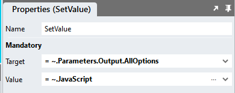

# Getting all options from CheckBox Lists

Stadium returns a list of all the Options and of the SelectedOptions from Checkbox List controls, but sometimes you may want to get a list of all options back

https://github.com/stadium-software/checkbox-list-all-options/assets/2085324/46f203a4-f118-4d16-b2a5-d8763d2c7b7a

## Version 
1.0

## Sample applications
This repo contains one Stadium 6.7 application
[FullCheckboxList.sapz](Stadium6/FullCheckboxList.sapz?raw=true)

## Global Script Setup
1. Create a Global Script and call it "FullCheckBoxList"
2. Add the two *Input Parameters* to the script
   1. Options
   2. SelectedOptions
3. Add the *Output Parameter* below to the script
   1. AllOptions
4. Drag a *Javascript* action into the script 
5. Paste the Javascript below into the *code* property (ignore the error "Invalid script was detected" in Stadium)
```javascript
/* Stadium Script Version 1.0 https://github.com/stadium-software/checkbox-list-all-options */
let options = ~.Parameters.Input.Options;
let selected = ~.Parameters.Input.SelectedOptions;
let all = [];
for (let i = 0; i < options.length; i++){
 let checked = false;
 if (selected.findIndex((item) => item.value == options[i].value) > -1) {
  checked = true;
 }
 let ob = {"text":options[i].text,"value":options[i].value,"checked":checked};
 all.push(ob);
}
return all;
```
6. Drag a *SetValue* action under the *Javascript* action
   1. Target: Select the output parameter *AllOptions* (= ~.Parameters.Output.AllOptions)
   2. Value: Select the Javascript action in the dropdown (= ~.JavaScript)



## Page Setup
The "FullCheckBoxList" script can be executed in any other script. this example uses a Button Click event to illustrate how to execute the script when the user clicks a button

1. Drag a *CheckBoxList* control into the page
2. Use the *Options* property to populate the *CheckBoxList* with data
3. Drag a *Button* control under the CheckBoxList
4. Create the *Button.Click* event handler

## Button.Click Event Handler Setup
The example in this sample shows what the script returns and how to loop through it. 

1. Drag the "FullCheckBoxList" script into the event script
2. Populate the Input Parameters 
   1. SelectedOptions: Select the *SelectedOptions* property of your checkbox list in the dropdown
   2. Options: Select the *Options* property of your checkbox list in the dropdown
3. The script returns an array of objects called *AllOptions*. Suggestions for using the data
   1. Assign the return value from the script *AllOptions* to a *Notification* action to see the entire result
   2. Assign *AllOptions* to a List of type "CheckBoxItem" ([see below](#type-setup)) and use a *ForEach* to get every checkbox object separately


## Type Setup
1. Create a type and call it "CheckBoxItem"
2. Add three properties to the type
   1. text (any)
   2. value (any)
   3. checked (any)


